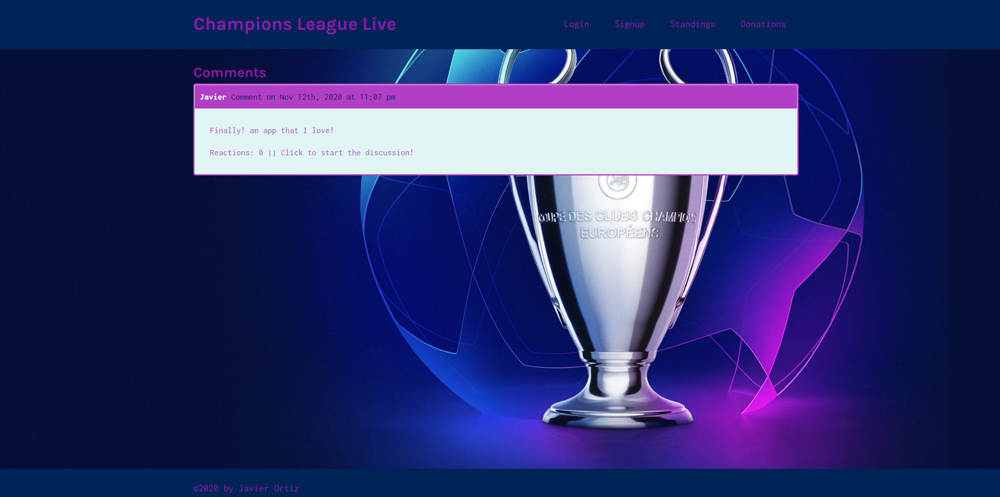

# Champions-League-Live

## Description
Champions League Live is a ionteractive MERN application. You can create an account and post comments, reply to comments, like comments, and even add other users as friends. The app also allows you to check the current standinds of the UEFA champions league in real time!  Create an account and give it a shot!! 
## Table of Contents
* [Link](#link)
* [Screenshot](#Scrrenshot)
* [License](#license)
* [Questions](#questions)

## Link
Checkout out the app!
https://desolate-island-49896.herokuapp.com/

## Screenshot

## License
Champions-League-Live is licensed under the MIT License.

## Questions
If you have any question please check out my GitHub https://github.com/ortizjavier10 or email me at ortiz.javier10@gmail.com .